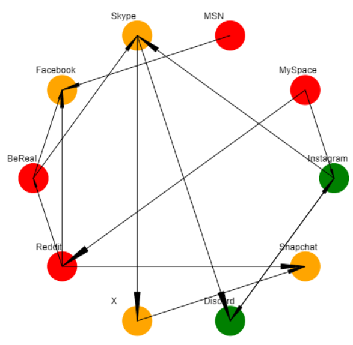
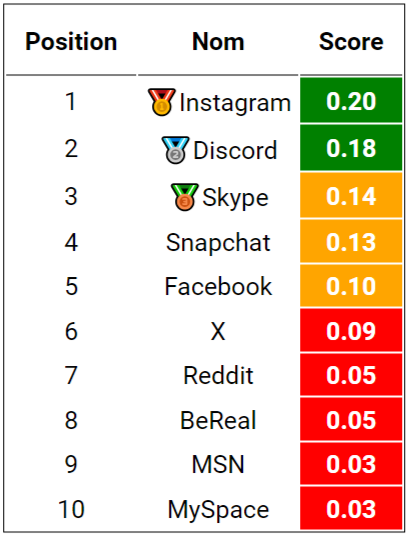

## Comment visualiser le projet ?
Plusieurs methodes :
* En allant sur le site que j'ai heberge sur [GitHub](https://lalbi94.github.io/PageRank_Visualizer/index.html).
* A l'aide de l'extension [LiveServer](https://marketplace.visualstudio.com/items?itemName=ritwickdey.LiveServer) de Visual Studio Code
* A l'aide de [Apache](https://httpd.apache.org/) dans repertoire `var/www`

## Fonctionnement de la modelisation
### A Savoir
Le site ajoute / supprime en permanence des liens. Si vous le demarrer en local, vous pouvez modifier l'interval vous-meme.
```js
const timingInterval = 40 // >= 0
```

Toutes les pertinences fixe sont attribuer dans le `main.js`
```js
export default class Page {
    /**
     * @param {number} id Identifiant de la page.
     * @param {string} name Nom du site.
     * @param {number} relevance Pertinence du site definit a la main.
     */
    constructor(id, name, relevance) {
        this.id = id
        this.name = name
        this.position = {x: 0, y: 0} // Position du cercle sur le graphe
        this.pagerank = 0.0
        this.relevance = relevance

        this.out = [] // Liens sortants
        this.in = [] // Liens entrants
    }
}
```
```js
const PGS = [
    new Page(0, "Instagram", 1/9),
    new Page(1, "Snapchat", 1/8),
    new Page(2, "Discord", 1/7),
    new Page(3, "X", 1/7),
    new Page(4, "Reddit", 1/6),
    new Page(5, "BeReal", 1/5),
    new Page(6, "Facebook", 1/5),
    new Page(7, "Skype", 1/3),
    new Page(8, "MSN", 1/2),
    new Page(9, "MySpace", 1/2)
]; 
```

L'iteration aleatoirement une `page x` et une `page y`.
```js
const page_x = 3 // Compris entre 1 et le nombre de page N.
const page_y = 5 // Compris entre 1 et le nombre de page N mais different de page_x.
```
Si la `page x` trouve la `page y` interessante, elle creer un lien vers elle.
```js
const page_x = {
    ...
    this.id = 3
    this.relevance = 1/9
    this.out = [
        {page: /*page y*/}
    ]
    ...
}

const page_y = {
    ...
    this.id = 3
    this.relevance = 1/6
    this.in = [
        {page: /*page x*/}
    ]
    ...
}
```
Le `page rank` est calcule dans cette fonction
```js
await gr.pagerank()
```

<br/>

Une fois le page rank de toutes les pages calcule, je genere le graphe
```js
await gr.generateGraph()
```
<br/>

J'actualise les scores dans le tableau a l'aide de
```js
await gr.generateRanking()
```
<br/>

À chaque itération, choisir aléatoirement une nouvelle `page x`. Identifie la moins pertinente parmi ses sorties (`page o`). Lance une probabilité basée sur la pertinence de la `page o`. Si la probabilité est favorable, supprime le lien ; sinon, ne fait rien.
```js
await gr.randomRemove()
```

## Membre
Bilal Boudjemline